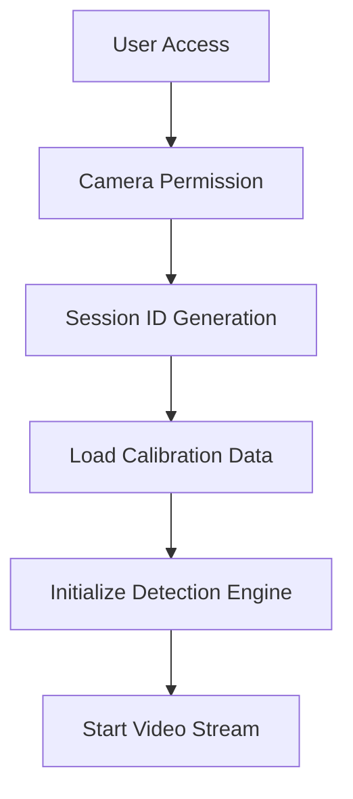
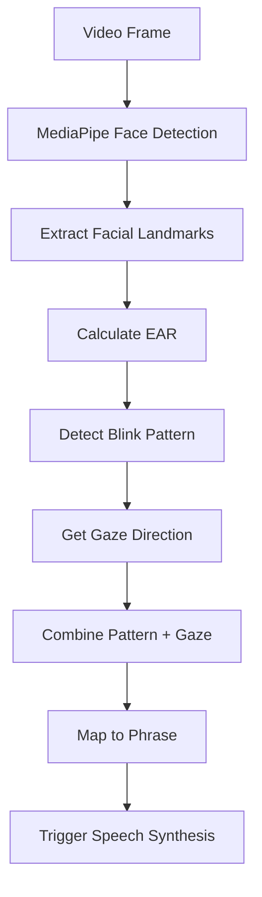
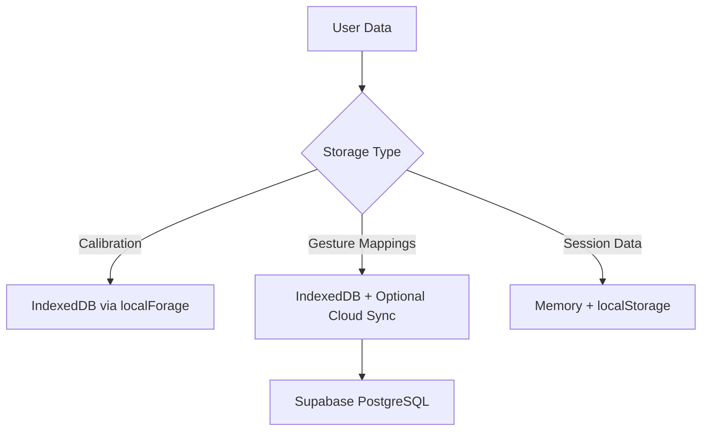

# System Architecture

This document provides a comprehensive overview of Blink Speech's system architecture, design patterns, and technical implementation details.

## 📐 High-Level Architecture

```
┌─────────────────────────────────────────────────────────────┐
│                    CLIENT (Browser)                         │
├─────────────────────────────────────────────────────────────┤
│  ┌─────────────┐  ┌─────────────┐  ┌─────────────────────┐  │
│  │   React     │  │   Gesture   │  │    Web Speech       │  │
│  │     UI      │◄─┤  Detection  │  │       API           │  │
│  │             │  │   Engine    │  │                     │  │
│  └─────────────┘  └─────────────┘  └─────────────────────┘  │
│         │               │                       │           │
│  ┌─────────────┐  ┌─────────────┐  ┌─────────────────────┐  │
│  │ LocalForage │  │ MediaPipe + │  │   Calibration       │  │
│  │   Storage   │  │  WebGazer   │  │     System          │  │
│  └─────────────┘  └─────────────┘  └─────────────────────┘  │
└─────────────────────────────────────────────────────────────┘
                            │
                    ┌───────────────┐
                    │   HTTPS/WSS   │
                    └───────────────┘
                            │
┌─────────────────────────────────────────────────────────────┐
│                    SERVER SIDE                              │
├─────────────────────────────────────────────────────────────┤
│  ┌─────────────┐  ┌─────────────┐  ┌─────────────────────┐  │
│  │   Next.js   │  │  Supabase   │  │      Twilio         │  │
│  │ API Routes  │◄─┤ PostgreSQL  │  │    SMS API          │  │
│  │             │  │             │  │                     │  │
│  └─────────────┘  └─────────────┘  └─────────────────────┘  │
└─────────────────────────────────────────────────────────────┘
```

## 🏗️ Component Architecture

### Frontend Architecture (React + Vite)

```
src/
├── components/           # Reusable UI components
│   ├── ui/              # Base UI components (Radix + Tailwind)
│   ├── landing/         # Landing page components
│   └── session/         # Session-specific components
├── hooks/               # Custom React hooks
│   ├── useGestureSpeech.ts    # Main gesture detection hook
│   └── use-toast.ts           # Toast notifications
├── pages/               # Route components
│   ├── Index.tsx        # Landing page
│   ├── Calibration.tsx  # Calibration interface
│   └── Session.tsx      # Main session interface
├── utils/               # Utility functions
│   ├── earUtils.ts      # Eye Aspect Ratio calculations
│   ├── gazeUtils.ts     # Gaze direction detection
│   └── speechSynthesis.ts     # Speech synthesis wrapper
└── types/               # TypeScript definitions
```

### Backend Architecture (Next.js API Routes)

```
backend/
├── pages/               # API route handlers
│   └── sendSMS.ts      # Twilio SMS integration
├── package.json        # Dependencies and scripts
└── .env.example        # Environment variables template
```

## 🔄 Data Flow

### 1. Session Initialization


### 2. Gesture Detection Pipeline


### 3. Data Storage Strategy


## 🧩 Core Modules

### 1. Gesture Detection Engine

**Location**: `src/hooks/useGestureSpeech.ts`

**Responsibilities**:
- Initialize MediaPipe FaceLandmarker
- Process video frames in real-time
- Calculate Eye Aspect Ratio (EAR)
- Detect blink patterns (single, double, triple, long)
- Integrate gaze direction data
- Trigger speech synthesis

**Key Components**:
```typescript
interface GestureSpeechOptions {
  onGestureDetected?: (gesture: string) => void;
  onPhraseSpoken?: (phrase: string) => void;
  blinkThreshold?: number;
  cooldownMs?: number;
}
```

### 2. Computer Vision Pipeline

**Eye Aspect Ratio (EAR) Calculation**:
```typescript
// MediaPipe Face Mesh landmark indices for eyes
const LEFT_EYE_INDICES = [362, 385, 387, 263, 373, 380];
const RIGHT_EYE_INDICES = [33, 160, 158, 133, 153, 144];

export function calculateEAR(landmarks: { x: number; y: number }[]): number {
  const leftEAR = calculateEyeAspectRatio(landmarks, LEFT_EYE_INDICES);
  const rightEAR = calculateEyeAspectRatio(landmarks, RIGHT_EYE_INDICES);
  return (leftEAR + rightEAR) / 2;
}
```

**Blink Pattern Detection**:
- **Single Blink**: Single EAR dip below threshold
- **Double Blink**: Two EAR dips within 400ms
- **Triple Blink**: Three EAR dips within 700ms
- **Long Blink**: EAR below threshold for >800ms

### 3. Gaze Tracking System

**Primary**: WebGazer.js for real-time gaze coordinates
**Calibration**: 5-point calibration system
**Direction Detection**: Based on deviation from calibrated center point

```typescript
export function getGazeDirection(x?: number, y?: number): string {
  const centerX = calibrationData?.centerX ?? window.innerWidth / 2;
  const centerY = calibrationData?.centerY ?? window.innerHeight / 2;
  const threshold = calibrationData?.threshold ?? 100;
  
  const deltaX = x - centerX;
  const deltaY = y - centerY;
  
  // Determine primary direction
  if (Math.abs(deltaX) > Math.abs(deltaY)) {
    return deltaX > 0 ? 'lookRight' : 'lookLeft';
  } else {
    return deltaY > 0 ? 'lookDown' : 'lookUp';
  }
}
```

### 4. Speech Synthesis Module

**Implementation**: Web Speech API wrapper
**Features**: Customizable voice, rate, pitch
**Fallback**: Console warning for unsupported browsers

```typescript
export function speakPhrase(text: string) {
  if ('speechSynthesis' in window) {
    const utterance = new SpeechSynthesisUtterance(text);
    speechSynthesis.cancel();
    speechSynthesis.speak(utterance);
  }
}
```

## 🎨 UI/UX Architecture

### Design System
- **Component Library**: Radix UI primitives
- **Styling**: Tailwind CSS with custom design tokens
- **Accessibility**: WCAG 2.1 AA compliance
- **Responsive Design**: Mobile-first approach

### State Management
- **Local State**: React useState for component-level state
- **Global State**: React Context for cross-component data
- **Persistent State**: localForage for client-side persistence
- **Server State**: TanStack Query for server synchronization

### Navigation Structure
```
/ (Landing Page)
├── /calibration (5-point gaze calibration)
└── /session (Main gesture detection interface)
    ├── Gesture Grid
    ├── Phrase Preview
    ├── Video Feed
    └── Settings Panel
```

## 🗄️ Database Design

### Supabase Schema

```sql
-- Gesture mappings table
CREATE TABLE patterns (
    sid TEXT PRIMARY KEY,           -- Session/User ID
    mapping JSONB NOT NULL,         -- Gesture-to-phrase mappings
    created_at TIMESTAMP DEFAULT NOW(),
    updated_at TIMESTAMP DEFAULT NOW()
);

-- Example mapping structure
{
  "singleBlink": "Hello",
  "doubleBlink": "Yes",
  "tripleBlink": "No",
  "longBlink": "Thank you",
  "singleBlink_lookLeft": "I need help",
  "singleBlink_lookRight": "I'm okay",
  "doubleBlink_lookUp": "Water please",
  "doubleBlink_lookDown": "I'm tired"
}
```

### Local Storage Schema

```typescript
// Calibration data
interface CalibrationData {
  centerX: number;
  centerY: number;
  threshold: number;
  points: Array<{ x: number; y: number }>;
  timestamp: number;
}

// User preferences
interface UserPreferences {
  speechEnabled: boolean;
  autoSpeak: boolean;
  blinkThreshold: number;
  gazeThreshold: number;
  voiceSettings: {
    rate: number;
    pitch: number;
    volume: number;
  };
}
```

## 🔒 Security Architecture

### Client-Side Security
- **Data Privacy**: No video data transmitted to server
- **Local Processing**: All computer vision processing client-side
- **Secure Storage**: Encrypted local storage for sensitive data
- **Session Management**: Secure UUID generation for session IDs

### Server-Side Security
- **HTTPS Only**: All communication encrypted in transit
- **Environment Variables**: Sensitive API keys stored securely
- **Input Validation**: All API inputs validated and sanitized
- **Rate Limiting**: Protection against API abuse

### Privacy Considerations
- **No Video Storage**: Video streams never stored or transmitted
- **Anonymous Usage**: No personal information required
- **Optional Cloud Sync**: Users control data synchronization
- **GDPR Compliance**: Data minimization and user control

## 🚀 Performance Architecture

### Optimization Strategies
- **Frame Rate Management**: Adaptive processing based on device capabilities
- **Memory Management**: Efficient cleanup of video streams and ML models
- **Lazy Loading**: Components loaded on demand
- **Bundle Optimization**: Code splitting and tree shaking

### Performance Targets
- **Detection Latency**: <150ms from blink to detection
- **Speech Latency**: <1s from gesture to speech output
- **Frame Processing**: 15-30 FPS depending on device
- **Memory Usage**: <100MB typical usage

## 🔄 Integration Patterns

### External Services
- **Supabase**: Database operations via REST API
- **Twilio**: SMS notifications via REST API
- **TensorFlow.js**: ML model loading and inference
- **WebGazer**: Gaze tracking integration

### Error Handling Strategy
- **Graceful Degradation**: Fallback mechanisms for each component
- **User Feedback**: Clear error messages and recovery suggestions
- **Logging**: Comprehensive error logging for debugging
- **Retry Logic**: Automatic retry for transient failures

## 📊 Monitoring & Analytics

### Performance Monitoring
- **Detection Accuracy**: Blink detection success rate
- **Latency Metrics**: Processing and response times
- **Error Rates**: Failure rates for critical operations
- **User Engagement**: Session duration and usage patterns

### Health Checks
- **Camera Access**: Verify camera permissions and functionality
- **ML Models**: Ensure TensorFlow.js models load correctly
- **API Connectivity**: Test backend service availability
- **Speech Synthesis**: Verify Web Speech API support

---

This architecture provides a solid foundation for a scalable, maintainable, and performant assistive communication tool while prioritizing user privacy and accessibility.
